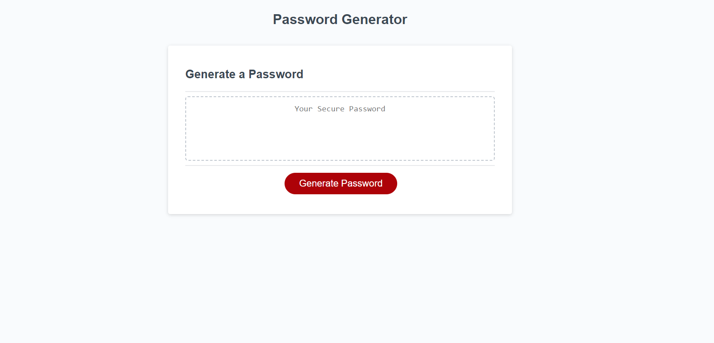

# PasswordGenerator-

## Description

It is a password generator that will generate a password that is between 8 to 128 characters.
It will include numbers, special, lowercase, and uppercase character depending on what you choose.

## Usage

To help create a random and unique password using your choice of numbers, special, lowercase, and uppercase characters.

## Credits

w3schools.com
github.com 
youtube.com
courses.bootcampspot